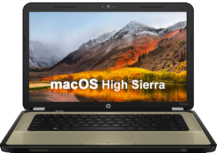

<p align="center">
  
</p>

These are the files of my working hackintosh laptop.
You can probably use the patched ```AML``` files directly. But if there is an even small difference between hardwares (i.e RAM differences, processor differences, wifi cards etc.), it will certainly cause problems.
NOTE: DOWNLOAD THE REPO AS ZIP OR CLONE IT WITH GIT.

What is working

- Intel Core i5 processor
- Intel HD 3000
- AMD Radeon HD 6470M
- HP Webcam
- Edimax 7811Un USB WiFi dongle
- Realtek RTL8105E
- Keyboard with special functions (volume up/down, media keys on iTunes)
- IDT Sound Card

What isn't working or hasn't been tested

- Realtek RTL5209 Card Reader (I haven't tested it)
- HDMI (Haven't tested it)
- VGA (haven't tested it)
- Atheros AR9285 Wi-Fi card
- Atheros AR0311 Bluetooth 3.0
- Brightness with slider
- Sleep and wake

Credits to:
- Slice
- AndyV
- RehabMan
- grexai926 @ InsanelyMac
- Mieze @ InsanelyMac
- nguyenmac
- PikerA
- EmlyDinEsh
- Toleda
- Sinetek @ InsanelyMac
- All the folks @ InsanelyMac
- Anyone else I might have forgotten
